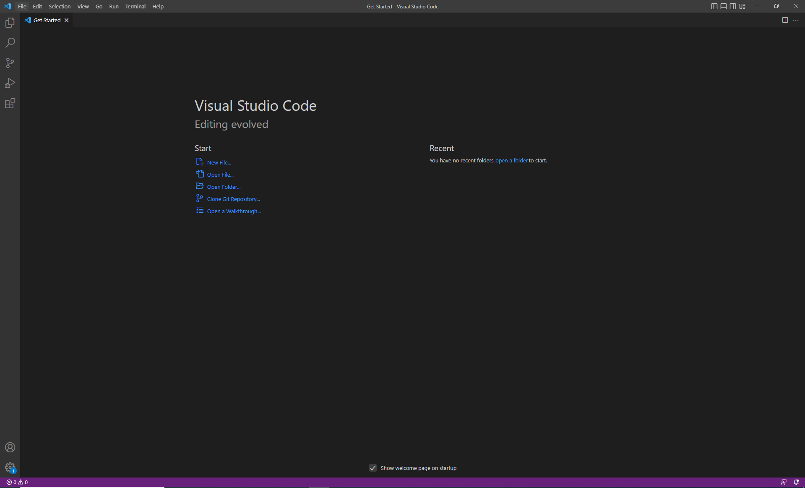
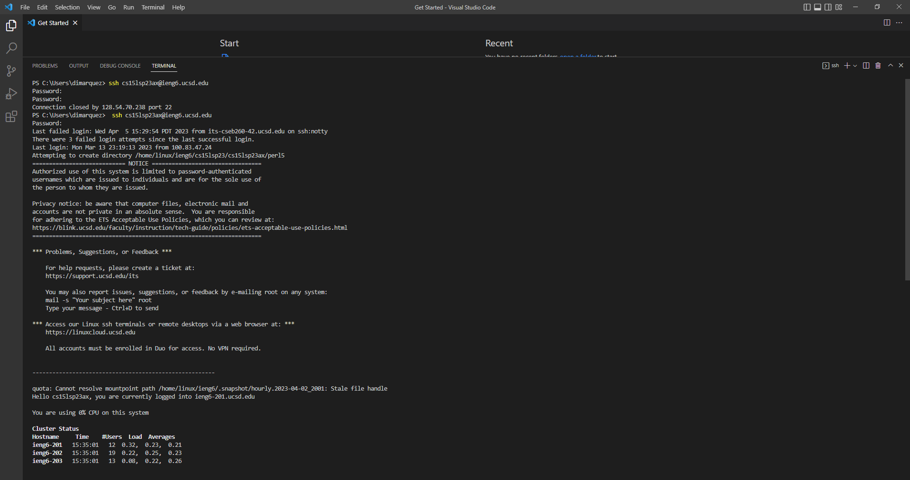
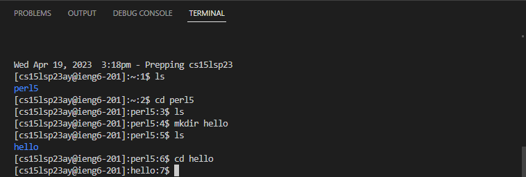
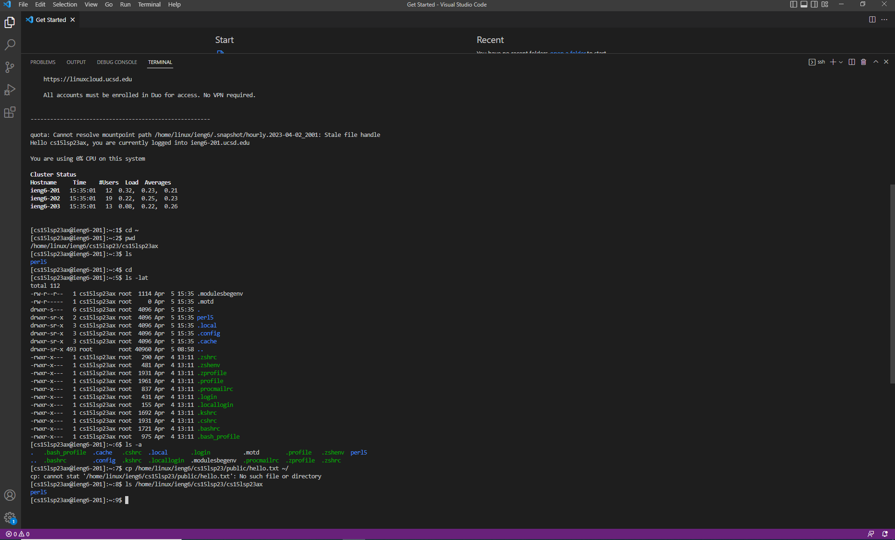

Lab Report 1
============
**Tutorial on logging into a course-specific account on ieng6!**

*Unfortunately I did not go through the trouble of installing VSCode or Git;
however I have included links to their installations!*

VS Code: [Link](https://code.visualstudio.com/)
Git: [Link](https://gitforwindows.org/)
Bash: [Link](https://stackoverflow.com/questions/42606837/how-do-i-use-bash-on-windows-from-the-visual-studio-code-integrated-terminal/50527994#50527994)

**Step 1: Opening Visual Studio Code and Finish Installation**
- The installation steps are explained by the VS installation software
- Once Visual Studio Code is open, it should look something like this:

*Note: different themes/appearance settings may look different*

**Step 2: Opening up the Terminal in VSCode**
- Open the terminal in VScode by the using the Command "CTRL" or "Command" + ` or use the Terminal -> New Terminal option
- Enter the command "<mark>ssh</mark> cs15lsp23__@ieng6.ucsd.edu" where the underscores are to be replaced with the letters in your course specific account!

*Note: (That’s one, five, l (lowercase letter L, not one);*
 - Upon entering, you may receive a message that the authenticity of host... you may enter 'yes' to enter

*Note: This message should only appear upon the first sign on, if it gets repeated, someone may be trying to control the connection!*
  - After entering 'yes' enter your password (Make sure you use the correct password or you will get an error message like this:
 
 
 
 *Note: it may not look like you're typing a password, but you are typing a password even if the cursor isn't moving!*
  
  **Step 3: Running Some Commands!**
  - you can try commands such as '<mark>cd</mark>' '<mark>ls</mark>' '<mark>pwd</mark>' '<mark>mkdir</mark>' '<mark>cp</mark>'
  - a few specific commands you can try are '<mark>cd ~</mark>' '<mark>ls -lat</mark>' '<mark>ls -a</mark>'
  - Commands running may look something like this:

**Example Running the <mark>mkdir</mark> command and making a new directory named "hello":**

**Example Running the <mark>cat</mark> and <mark>cp</mark> commands!**

  
  
  
  **Step 4: Logging off**
  Logging out of the remote server is quite simple using either of the two options:
  - Using the command 'Ctrl-D'
  - Run the command '<mark>exit</mark>'
 
 *Note: you can run multiple terminals in VSCode using the smalle '+' button at the top of the terminal window!*
  

